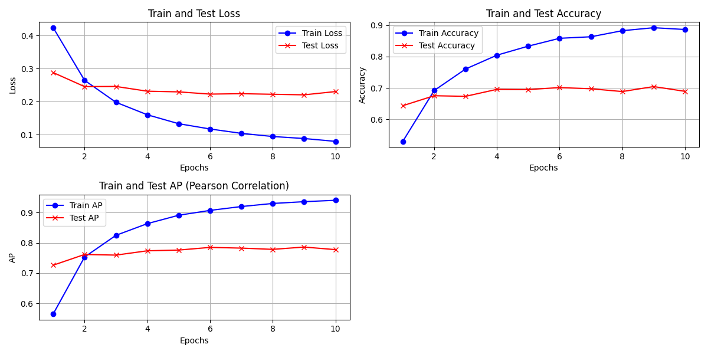

# BertCNSEP

基于Python编程语言，使用Hugging Face提供的已经完成预训练的bert-base-chinese模型，以Sina2016为数据集，针对Social Emotion Prediction这个任务对完成了预训练的Bert模型进行了微调。

完成了微调的Bert模型可以预测某段中文新闻文本在读者群体中所引发的情绪反应。

在训练的过程中使用了Acc@1和AP作为评估：

---

在运行`train.py`和`test.py`之前，你需要从[HUGGING FACE](https://huggingface.co/google-bert/bert-base-chinese)下载`bert-base-chinese`模型，将其中的`config.json`，`pytorch_model.bin`和`vocab.txt`放置在文件夹`bert-base-chinese`下；从[SocialEmotionData](https://github.com/lixintong1992/SocialEmotionData)下载`2016.1-2016.11`并且放置在文件夹`data`下。

---

如果这些内容对你有帮助，可以给我一颗⭐